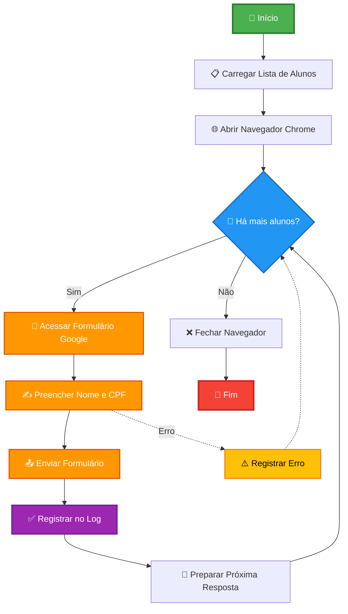

# 🤖 Automação de Formulário Google com Selenium

Projeto de automação para preenchimento de formulários Google usando **Java 21**, **Maven 4.0.0** e **Selenium WebDriver**.

## 📋 Índice

- [Tecnologias](#-tecnologias)
- [Pré-requisitos](#-pré-requisitos)
- [Estrutura do Projeto](#-estrutura-do-projeto)
- [Instalação](#-instalação)
- [Como Usar](#-como-usar)
- [Executando o Projeto](#-executando-o-projeto)
- [Logs](#-logs)
- [Configuração](#-configuração)

## 🚀 Tecnologias

- **Java 21** - Linguagem com features modernas (Records, Text Blocks, Pattern Matching)
- **Maven 4.0.0** - Gerenciamento de dependências e build
- **Selenium WebDriver 4.25.0** - Automação de navegadores
- **WebDriver Manager 5.9.2** - Gerenciamento automático de drivers
- **SLF4J 2.0.16 + Logback 1.5.8** - Sistema de logging

  ## 📊 Fluxograma



## ✅ Pré-requisitos

- ☕ **Java 21** ou superior ([Download](https://www.oracle.com/java/technologies/downloads/))
- 📦 **Maven 4.0.0** ou superior ([Download](https://maven.apache.org/download.cgi))
- 🌐 **Google Chrome** instalado
- 💻 Sistema operacional: Windows, macOS ou Linux

Verifique as instalações:
```bash
java -version
mvn -version
```

## 📁 Estrutura do Projeto

```
formulario-selenium/
├── src/
│   ├── main/
│   │   ├── java/
│   │   │   └── com/
│   │   │       └── automacao/
|                   ├── model/
│   │   │           |    └── Aluno.java               # Record do aluno
│   │   │           └── FormularioAutomation.java    # Classe principal
│   │   │           
│   │   └── resources/
│   │       └── logback.xml                          # Configuração de logs
├── target/                                          # Arquivos compilados (gerado)
├── log_envios.txt                                   # Log de execuções (gerado)
├── .gitignore                                       # Exclusões do Git
├── pom.xml                                          # Configuração Maven
└── README.md                                        # Este arquivo
```


## 🔧 Instalação

### 1. Clone ou crie o projeto

```bash
# Criar estrutura de diretórios
mkdir -p formulario-selenium/src/main/java/com/automacao/model
mkdir -p formulario-selenium/src/main/resources
cd formulario-selenium
```

### 2. Adicione os arquivos

Copie os arquivos para suas respectivas pastas:

- `pom.xml` → raiz do projeto
- `FormularioAutomation.java` → `src/main/java/com/automacao/`
- `Aluno.java` → `src/main/java/com/automacao/model/`
- `logback.xml` → `src/main/resources/`
- `.gitignore` → raiz do projeto
- `README.md` → raiz do projeto

### 3. Baixe as dependências

```bash
mvn clean install
```

## 💡 Como Usar

### 1. Configurar lista de alunos

Edite o método `main()` em `FormularioAutomation.java`:

```java
List<Aluno> alunos = List.of(
    new Aluno("João Silva", "123.456.789-00"),
    new Aluno("Maria Santos", "987.654.321-00"),
    new Aluno("Pedro Oliveira", "456.789.123-00")
);
```

### 2. Configurar URL do formulário (opcional)

Se necessário, altere a constante `FORM_URL`:

```java
private static final String FORM_URL = "sua-url-aqui";
```

### 3. Ajustar tempos de espera (opcional)

Modifique os valores de `Thread.sleep()` conforme necessário:

```java
Thread.sleep(3000); // 3 segundos
```

## ▶️ Executando o Projeto

### Opção 1: Via Maven (recomendado para desenvolvimento)

```bash
mvn clean compile exec:java -Dexec.mainClass="com.automacao.FormularioAutomation"
```

### Opção 2: Gerar JAR executável

```bash
# Gerar o JAR com dependências
mvn clean package

# Executar o JAR
java -jar target/formulario-selenium-1.0.0-jar-with-dependencies.jar
```

### Opção 3: Via IDE

1. Abra o projeto na sua IDE (IntelliJ IDEA, Eclipse, VS Code)
2. Execute a classe `FormularioAutomation.java`
3. Clique com botão direito → Run

## 📊 Logs

Os logs são gravados em **dois locais**:

### Console
```
2025-10-30 14:30:15 - INFO - WebDriver inicializado com sucesso
2025-10-30 14:30:16 - INFO - Iniciando processamento de 3 alunos
2025-10-30 14:30:17 - INFO - Processando aluno: Aluno[nome=Ana Paula Souza, cpf=123.456.789-00]
2025-10-30 14:30:20 - INFO - Dados preenchidos para: Ana Paula Souza
2025-10-30 14:30:22 - INFO - Formulário enviado para: Ana Paula Souza - 123.456.789-00
```

### Arquivo `log_envios.txt`
Mesmo formato do console, persistido em arquivo para auditoria.

## ⚙️ Configuração

### Opções do Chrome

Adicione mais opções em `FormularioAutomation.java`:

```java
ChromeOptions options = new ChromeOptions();
options.addArguments("--start-maximized");
options.addArguments("--headless");              // Modo sem interface gráfica
options.addArguments("--disable-gpu");           // Desabilita GPU
options.addArguments("--no-sandbox");            // Para ambientes Linux
options.addArguments("--disable-dev-shm-usage"); // Para ambientes com pouca memória
```

### Timeout de espera

Ajuste o tempo de espera em `WAIT_TIMEOUT`:

```java
private static final Duration WAIT_TIMEOUT = Duration.ofSeconds(15);
```

### Nível de log

Edite `logback.xml` para alterar o nível de detalhamento:

```xml
<root level="DEBUG">  <!-- INFO, WARN, ERROR, DEBUG -->
    <appender-ref ref="CONSOLE" />
    <appender-ref ref="FILE" />
</root>
```

##  Solução de Problemas

### Erro: ChromeDriver não encontrado
**Solução:** O WebDriver Manager baixa automaticamente. Verifique sua conexão com a internet.

### Erro: Campos não encontrados
**Solução:** O formulário pode ter mudado. Ajuste os seletores CSS em `processarAluno()`.

### Erro: Timeout ao clicar em botões
**Solução:** Aumente o valor de `WAIT_TIMEOUT` ou dos `Thread.sleep()`.

### Chrome não abre
**Solução:** Verifique se o Google Chrome está instalado e atualizado.

## 📝 Comandos Úteis

```bash
# Limpar build anterior
mvn clean

# Compilar
mvn compile

# Executar testes (se houver)
mvn test

# Gerar JAR
mvn package

# Ver dependências
mvn dependency:tree

# Atualizar dependências
mvn versions:display-dependency-updates
```

## 🤝 Contribuindo

1. Fork o projeto
2. Crie uma branch para sua feature (`git checkout -b feature/MinhaFeature`)
3. Commit suas mudanças (`git commit -m 'Adiciona MinhaFeature'`)
4. Push para a branch (`git push origin feature/MinhaFeature`)
5. Abra um Pull Request


## ✨ Melhorias Futuras

- [ ] Suporte a múltiplos navegadores (Firefox, Edge)
- [ ] Leitura de dados de arquivo CSV/Excel
- [ ] Interface gráfica (JavaFX/Swing)
- [ ] Relatório HTML de execução
- [ ] Testes unitários com JUnit
- [ ] Configuração via arquivo properties/YAML
- [ ] Modo headless configurável via argumento

## 📧 Contato

Para dúvidas ou sugestões, abra uma issue no repositório.

---

**Desenvolvido com ☕ e Java 21**
## 📄 Licença

Este projeto é de código aberto para fins educacionais.

